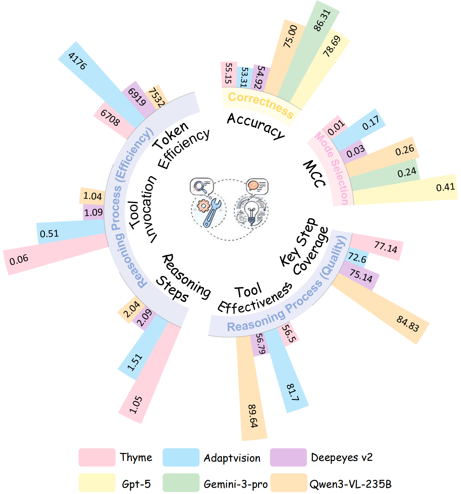
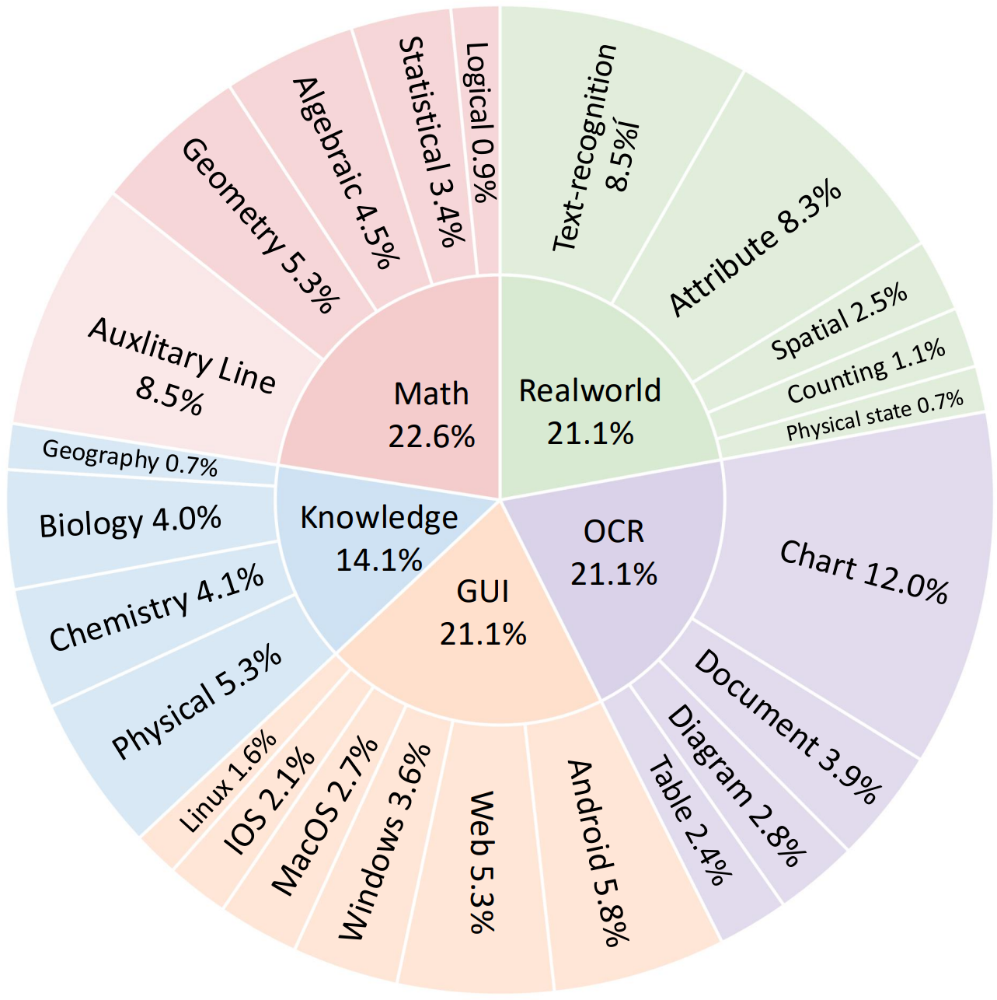
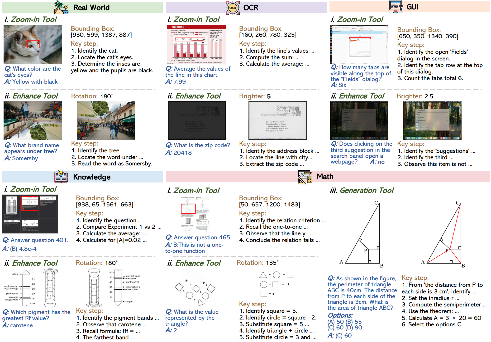
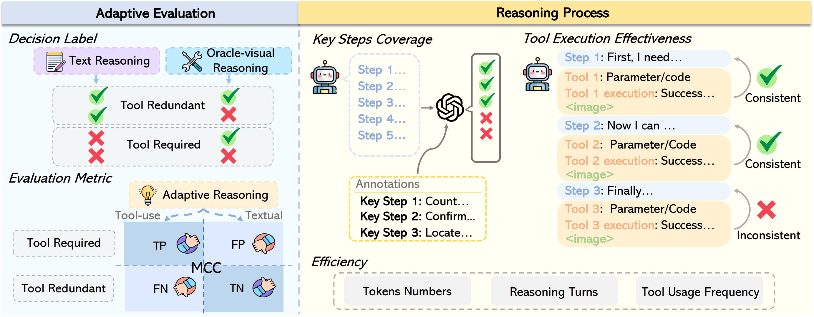

  

    <h1>
      AdaptMMBench: Benchmarking Adaptive Multimodal Reasoning for Mode Selection and Reasoning Process
    </h1>
  

   

  
  
  

<!-- 
 

<b>Authors:</b> 
<a class="name" target="_blank" href="https://github.com/xtong-zhang">Xintong Zhang</a>1,2*,
<a class="name" target="_blank" href="https://github.com/XiaowZhang00">Xiaowen Zhang</a>2,3*,
<a class="name" target="_blank" href="https://github.com/RubyNg">Jongrong Wu</a>2*,
<a class="name" target="_blank" href="https://zhigao2017.github.io/">Zhi Gao</a>1,2,4†✉️,
<a class="name" target="_blank" href="https://scholar.google.com/citations?user=2VhjOykAAAAJ&hl=zh-CN">Shilin Yan</a>5†,
 
<a class="name" target="_blank" href="https://adaptmmbench.github.io/">Zhenxin Diao</a>1‡,
<a class="name" target="_blank" href="https://adaptmmbench.github.io/">Kunpeng Gao</a>1‡,
<a class="name" target="_blank" href="https://adaptmmbench.github.io/">Xuanyan Chen</a>1‡,
<a class="name" target="_blank" href="https://wu-yuwei-bit.github.io/">Yuwei Wu</a>1,4✉️,
<a class="name" target="_blank" href="https://scholar.google.com/citations?user=Sl6TV7gAAAAJ&hl=en">Yunde Jia</a>4,
<a class="name" target="_blank" href="https://liqing.io/">Qing Li</a>2✉️
 
 
1Beijing Key Laboratory of Intelligent Information Technology, School of Computer Science & Technology, Beijing Institute of Technology 
2State Key Laboratory of General Artificial Intelligence, BIGAI 
3Xidian University 
4Guangdong Laboratory of Machine Perception and Intelligent Computing, Shenzhen MSU-BIT University 
5Alibaba Group
 
*Core contribution, †Project supervisor, ‡Equal contribution, ✉️Corresponding authors
 -->

# 🔥News
- [2026/02/03] We released arxiv paper and data samples of AdaptMMBench. Welcome to download and explore them!
 

# Overview

While adaptive multimodal reasoning shows great promise, current studies **lack an independent evaluation of the mode selection mechanism and often neglect fine-grained process analysis.** To address this gap, we propose AdaptMMBench, which isolates the assessment of **mode selection capability** by dynamically identifying model capability boundaries and utilizing the Matthews Correlation Coefficient (MCC). Furthermore, it facilitates **a multi-dimensional process evaluation** encompassing quality(key step coverage, tool effectiveness) and efficiency(reasoning turn, tool invocation frequency, token consumption). Our evaluation reveals that while adaptive mode selection scales with model capacity, it notably decouples from final accuracy. Furthermore, tool effectiveness exhibits significant inconsistency across different model architectures.

  
  

 

# AdaptMMBench

### Benchmark

AdaptMMBench encompasses **1,420 samples** spanning **five domains: real-world, OCR, GUI, math, and knowledge**. To ensure a comprehensive evaluation, the dataset spans a range of difficulty levels, balancing tasks that can be solved through text-only reasoning with those that require **adaptive tool invocation**, such as zooming and image transformations (e.g., rotation and contrast adjustment). Benchmark quality is maintained through a rigorous multi-stage verification pipeline, in which human annotators and GPT-5 collaboratively validate **bounding box annotations** and **key reasoning steps**.

### Metrics

Adaptive Mode Selection Evaluation
 

Adaptive intelligence depends on a model’s ability to judge whether its available information is sufficient to solve a task; therefore, reasoning mode selection should be evaluated independently of answer correctness. Under this principle, tasks solvable via text-only reasoning are labeled **Tool-Redundant**, while those requiring additional visual information are labeled **Tool-Required**. Mode selection is evaluated using a confusion matrix, where correct and incorrect tool invocation decisions correspond to TP, FN, TN, and FP cases.

**Matthews Correlation Coefficient (MCC).** Because the proportion of tool-redundant and tool-required cases varies across models, leading to class imbalance, we adopt MCC as a robust evaluation metric.

$$
\text{MCC} =
\frac{TP \cdot TN - FP \cdot FN}
{\sqrt{(TP+FP)(TP+FN)(TN+FP)(TN+FN)} + \epsilon}
$$

where $\epsilon$ is a small constant for numerical stability. MCC ranges from $[-1,1]$, with $1$ indicating perfect agreement with the optimal mode selection, $0$ denoting the chance-level performance, and $-1$ indicating complete misalignment.

Reasoning Process Evaluation

We evaluate the reasoning process from both **quality** and **efficiency** perspectives. Reasoning **quality** is measured by **key step coverage**, which assesses logical alignment with human-annotated solution steps, and **tool execution effectiveness**, which evaluates whether each tool invocation correctly serves the intended purpose of its corresponding reasoning step and is executed without errors. Reasoning **efficiency** is assessed using the number of **reasoning steps**, **tool invocation frequency**, and **total token consumption**.

